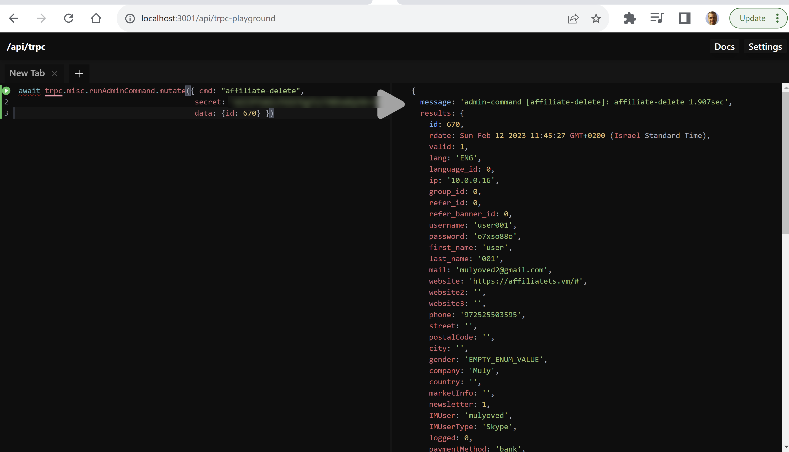

# How to run admin commands

Open [trpc-playground](http://localhost:3001/api/trpc-playground)

## Delete user

await trpc.misc.runAdminCommand.mutate({ cmd: "affiliate-delete",
secret: <for local can be empty, take secret from .env NEXTAUTH_SECRET>,
data: {id: 670} })
